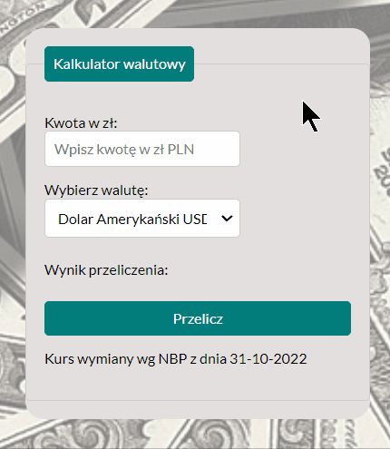

# currency_calculator

## Demo:

https://jacekdu.github.io/currency_calculator/

## Description:

This is very simple currency calculator which converts Polish Zloty (PLN) into either USD, Euro, GBP.

## Procedure:
1. Enter value in PLN - (the first field from the top),
2. Choose currency from drop-down menu - avilable: USD / Euro / GBP - (the second field from the top),
3. Press button described as "Przelicz",
4. Result will occur above the button.

## Tools Used:

- HTML - Living Standard,
- CSS,
- Javascript - ECMAScript 2020,
- BEM convention,
- Normalise.css,
- GIF - [ScreenToGif](https://www.screentogif.com/)
